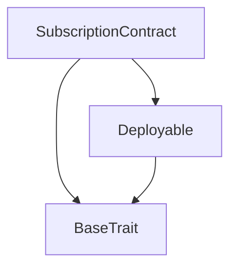

# TACT Compilation Report
Contract: SubscriptionContract
BOC Size: 1481 bytes

# Types
Total Types: 15

## StateInit
TLB: `_ code:^cell data:^cell = StateInit`
Signature: `StateInit{code:^cell,data:^cell}`

## StdAddress
TLB: `_ workchain:int8 address:uint256 = StdAddress`
Signature: `StdAddress{workchain:int8,address:uint256}`

## VarAddress
TLB: `_ workchain:int32 address:^slice = VarAddress`
Signature: `VarAddress{workchain:int32,address:^slice}`

## Context
TLB: `_ bounced:bool sender:address value:int257 raw:^slice = Context`
Signature: `Context{bounced:bool,sender:address,value:int257,raw:^slice}`

## SendParameters
TLB: `_ bounce:bool to:address value:int257 mode:int257 body:Maybe ^cell code:Maybe ^cell data:Maybe ^cell = SendParameters`
Signature: `SendParameters{bounce:bool,to:address,value:int257,mode:int257,body:Maybe ^cell,code:Maybe ^cell,data:Maybe ^cell}`

## Deploy
TLB: `deploy#946a98b6 queryId:uint64 = Deploy`
Signature: `Deploy{queryId:uint64}`

## DeployOk
TLB: `deploy_ok#aff90f57 queryId:uint64 = DeployOk`
Signature: `DeployOk{queryId:uint64}`

## FactoryDeploy
TLB: `factory_deploy#6d0ff13b queryId:uint64 cashback:address = FactoryDeploy`
Signature: `FactoryDeploy{queryId:uint64,cashback:address}`

## SubscriptionPeriod
TLB: `subscription_period#77872719 period:uint32 = SubscriptionPeriod`
Signature: `SubscriptionPeriod{period:uint32}`

## UpdatePrice
TLB: `update_price#247e576d newPrice:coins = UpdatePrice`
Signature: `UpdatePrice{newPrice:coins}`

## UpdateFeeRate
TLB: `update_fee_rate#f1d68848 newRate:uint32 = UpdateFeeRate`
Signature: `UpdateFeeRate{newRate:uint32}`

## Withdraw
TLB: `withdraw#0ba69751 amount:coins = Withdraw`
Signature: `Withdraw{amount:coins}`

## Subscribe
TLB: `subscribe#5c72342d  = Subscribe`
Signature: `Subscribe{}`

## Refund
TLB: `refund#ad7c3add  = Refund`
Signature: `Refund{}`

## SubscriptionContract$Data
TLB: `null`
Signature: `null`

# Get Methods
Total Get Methods: 5

## checkSubscription
Argument: user

## expiryTime
Argument: user

## price

## balance

## feeRate

# Error Codes
2: Stack underflow
3: Stack overflow
4: Integer overflow
5: Integer out of expected range
6: Invalid opcode
7: Type check error
8: Cell overflow
9: Cell underflow
10: Dictionary error
11: 'Unknown' error
12: Fatal error
13: Out of gas error
14: Virtualization error
32: Action list is invalid
33: Action list is too long
34: Action is invalid or not supported
35: Invalid source address in outbound message
36: Invalid destination address in outbound message
37: Not enough TON
38: Not enough extra-currencies
39: Outbound message does not fit into a cell after rewriting
40: Cannot process a message
41: Library reference is null
42: Library change action error
43: Exceeded maximum number of cells in the library or the maximum depth of the Merkle tree
50: Account state size exceeded limits
128: Null reference exception
129: Invalid serialization prefix
130: Invalid incoming message
131: Constraints error
132: Access denied
133: Contract stopped
134: Invalid argument
135: Code of a contract was not found
136: Invalid address
137: Masterchain support is not enabled for this contract
5370: Balance is not enough
14782: Payment amount is not enough
16053: Only owner can call
18315: No active subscription
24905: Invalid fee rate
38981: Subscription already expired
50036: Price must be greater than 0
62817: Contract balance not enough for refund

# Trait Inheritance Diagram

# Contract Dependency Diagram

